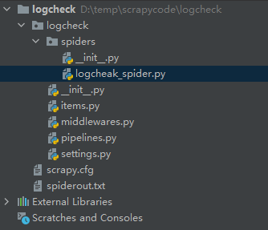

# Scrapy爬虫框架

Scrapy是一个为了爬取网站数据，提取结构性数据而编写的应用框架。只需要编写很少的代码就能实现抓取功能，另外由于它底层用了twisted，性能也非常优越。使用Scrapy框架编写的抓取代码，可读性很强，非常利于维护，是现在最流行的抓取框架。

## 创建爬虫

首先是在anaconda下安装scrapy，然后使用anaconda的终端anaconda powershell prompt，在要创建爬虫的目录下使用。生成了如下的文件结构，然后在spiders目录下写一个你自己的python文件作为你的爬虫：

```python
scrapy startproject <spirder_name>   #创建项目
scrapy crawl XX（运行XX蜘蛛）  #运行蜘蛛
scrapy shell http://www.scrapyd.cn  #调试网址为http://www.scrapyd.cn的网站
```



```python
import scrapy
from urllib.parse import quote
import string
import re

class logcheck(scrapy.Spider):
    name = "logcheck"  #定义蜘蛛的名字
   
    def start_requests(self):
        # 请求的头，主要是为了爬有密码的网站时，需要做一个带cookie的请求头
				# 请求头需要在浏览器中自己查找
				headers = {
            'User-Agent': 'Mozilla/5.0 (Windows NT 10.0; Win64; x64) AppleWebKit/537.36 (KHTML, like Gecko) Chrome/85.0.4183.102 Safari/537.36 Edg/85.0.564.51',
            'Cookie': ''
        }
				# 请求的网址
        urls = [
						"www.baidu.com"
				]
				# 启动爬虫，callback=self.parse代表将爬到的数据交给parse处理
        for url in urls:
            yield scrapy.Request(url=url, headers=headers, callback=self.parse)

    def parse(self, response):
	      # 使用xpath处理爬下来的数据
				logout1 = response.xpath('//div[@class=$val1]/table/tbody', val1='table-responsive').extract_first(default='not-found')
        # 使用python的函数处理数据
				logout2 = logout1.replace('<tbody>', '').replace('</tbody>', '').replace('<tr>', '').replace('</tr>', '').replace('<td>','').replace('</td>', ' ').replace(r'<td colspan="9" class="empty message">暂无数据', '')
        logout3 = re.sub(r'[ ]*\n[ ]*', '\n',logout2)
        logout4 = re.sub('[\n]+', '\n', logout3)
        logout4 = logout4.lstrip()
        logout4 = logout4.rstrip()
        if(logout4 == ""):
            return
				# 写入文件
        with open("spiderout.txt", 'a+') as f:
            f.write(logout4+'\n')

        self.log('test of spider')
```

Request ovjects：

[Copy of Request ovjects：](https://www.notion.so/b320bac7a41642c7983db97e79434c83)

运行爬虫：

```python
scrapy crawl  logcheck
```

这里要重点提醒一下，我们一定要进入：logcheck 这个目录，也就是我们创建的蜘蛛项目目录，以上命令才有效！还有 crawl 后面跟的是你类里面定义的蜘蛛名，也就是：name，并不是项目名、也不是类名，这些细节希注意！

除了代码，还可以直接使用命令行爬一个网页：

```python
scrapy shell http://www.baidu.com
```

## 数据提取

上面我们已经大致了解了爬虫的使用，即定义好url后使用scrapy.Request()请求，然后使用parse()处理爬到的数据。这是一个相当便捷的过程，而爬虫的主要工作却不在爬取网页，而是处理数据。对于爬下来的reponse，如何处理出我们想要的数据？

Scrapy提取数据有自己的一套机制。它们被称作选择器(seletors)，因为他们通过特定的 XPath 或者 CSS 表达式来“选择” HTML文件中的某个部分。XPath 是一门用来在XML文件中选择节点的语言，也可以用在HTML上。 CSS 是一门将HTML文档样式化的语言。选择器由它定义，并与特定的HTML元素的样式相关连。response.xpath()是response.selector.xpath()的简写，css()同理。

.xpath() 及 .css() 方法返回一个类 SelectorList 的实例, 它是一个新选择器的列表。这个API可以用来快速的提取嵌套数据。

[Scrapy css选择器提取数据！_Scrapy1.5中文文档_Scrapy 中文网](http://www.scrapyd.cn/doc/185.html)

[选择器(Selectors) - Scrapy 1.0.5 文档](https://scrapy-chs.readthedocs.io/zh_CN/1.0/topics/selectors.html)

[CSS选择器](https://www.notion.so/037ef54178e445d5927cee8b5937d70d)

比较重要的：`.`代表class，`空格`代表层级关系， `::`代表元素属性

[Xpath选择器](https://www.notion.so/d43e1d0280dc4710913388c741dca30f)

如果我们希望提取某个ol的href元素： `reponse.xpath("//ol[@class='page-navigator']//@href")`

## 添加请求头

对于一个需要使用账号密码登陆的网站我们显然是不能直接使用爬虫去爬取数据的，这时候我们总不能去手动输入账号密码把，对于这种情况我们可以自己造一个请求头，请求头中包含一个cookie，由于除了第一次登陆，网站会通过cookie来判断用户信息。所以说我们只用把cookie传过去，就不用再判断用户名和密码了。

首先，去获取一个cookie


```python
headers = {
            'User-Agent': '',
            #使用密码登陆后，找到网站的cookie
            'Cookie': ''
        }
yield scrapy.Request(url=url, headers=headers, callback=self.parse)
```

通过这种方式，就可以解决登陆的问题了

## 常见问题

### 爬虫出现Forbidden by robots.txt

先说结论，关闭scrapy自带的ROBOTSTXT_OBEY功能，在setting找到这个变量，设置为False即可解决。

使用scrapy爬取淘宝页面的时候，在提交http请求时出现debug信息Forbidden by robots.txt，看来是请求被拒绝了。开始因为是淘宝页面有什么保密机制，防止爬虫来抓取页面，于是在spider中填入各种header信息，伪装成浏览器，结果还是不行。。。用chrome抓包看了半天感觉没有影响简单页面抓取的机制（其他保密机制应该还是有的，打开一个页面时，向不同服务器递交了很多请求，还设定了一些不知道干啥的cookies），最后用urllib伪造请求发现页面都能抓取回来。于是上网查了一下robot.txt是什么，发现原来有个robot协议，终于恍然大悟：

我们观察scrapy抓包时的输出就能发现，在请求我们设定的url之前，它会先向服务器根目录请求一个txt文件：

```python
2016-06-10 18:16:26 [scrapy] DEBUG: Crawled (200) <GET https://item.taobao.com/robots.txt> (referer: None)
```

这个文件中规定了本站点允许的爬虫机器爬取的范围（比如你不想让百度爬取你的页面，就可以通过robot来限制），因为默认scrapy遵守robot协议，所以会先请求这个文件查看自己的权限，而我们现在访问这个url得到

```python
User-agent: *
Disallow: /
```

可以看见，淘宝disallow根目录以下所有页面。（似乎有新闻说淘宝关闭了爬虫对它们的爬取权限，因为涉及到用户隐私）所以scrapy就停止了之后的请求和页面解析。

我们在setting改变ROBOTSTXT_OBEY为False，让scrapy不要遵守robot协议，之后就能正常爬取了。

Scrapy是一种”君子协定“。